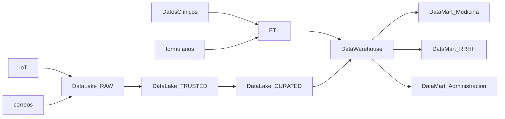
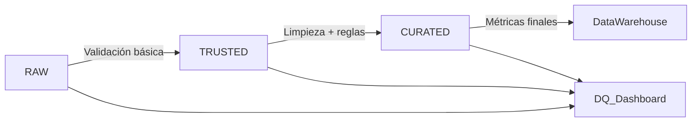

# Arquitectura de datos y Modelado dimensional

Este repositorio documenta dos casos de arquitectura y modelado de datos aplicados a escenarios inspirados en empresas reales: diseño de una arquitectura de datos por capas (Data Lake, Data Warehouse, gobernanza) y modelado dimensional para analítica de negocio (esquema estrella, enfoque Kimball).

Índice:
- [I. Arquitectura de Datos](#etapa-1-arquitectura-de-datos)
    - [Arquitectura de Datos](#etapa-1-arquitectura-de-datos)
    - [Enfoques para el Almacenamiento y Gestión de los Datos](#etapa-2-enfoques-para-el-almacenamiento-y-gestión-de-los-datos)
    - [Calidad de los Datos](#etapa-3-calidad-de-los-datos)
- [II. Modelamiento Multidimensional](#etapa-4-modelamiento-multidimensional)
- [Análisis transversal](#an%C3%A1lisis-transversal)
- [Conclusión](#conclusi%C3%B3n)

# I. Arquitectura de Datos

## 1. Arquitectura de Datos

### Introducción

Este documento tiene como objetivo principal abordar el desafío de la gestión de datos en la empresa InfoHealth. A través del rol de Arquitecto de Datos, se propone un análisis exhaustivo de la situación actual, identificando las deficiencias clave que impiden la optimización de los procesos. 

Basado en este diagnóstico, se presenta una propuesta de arquitectura de datos y un plan de mejora, diseñados para garantizar la escalabilidad, seguridad y accesibilidad, pilares fundamentales para el crecimiento sostenido de la organización en el sector salud.

### Diagnóstico

Debido a la gran abundancia y diversidad de fuentes de datos junto a la falta de arquitectura de datos ha provocado un escenario donde ya se han reportado varios casos de duplicación de datos que sin trazabilidad genera riesgos de confianza, además se han detectado riesgos de seguridad en el acceso a la información.

Esta situación ha afectado al equipo de analistas de datos ya que el tiempo empleado en preprocesar los datos ha crecido exponencialmente.

Además la dirección y el staff médico han perdido la confianza en los reportes, por lo que es clave priorizar el proyecto ya que se requiere un sistema ágil y preciso para apoyar la operación del negocio.

### Propuesta

Se propone una arquitectura basada en capas que separa responsabilidades:

- Fuentes de datos: Datos clínicos, IoT, formularios, correos.
- Almacenamiento: Data Lake (no estructurados), Data Warehouse (estructurados).
- Procesamiento: ETL/ELT.
- Acceso: Dashboards de BI.
- Seguridad: Cifrado de datos. Control de acceso.

Diagrama de fuentes de datos, ingesta, integración y almacenamiento:

### Gobernanza

Para la Gobernanza se aplicaron los principios del marco DAMA-DMBOK destacando los siguientes aspectos:

- Calidad de datos: Garantizar la precisión y consistencia.
- Arquitectura de datos: permite la escalabilidad del sistema, promueve el reuso de componentes y facilita la trazabilidad de los datos.
- Modelado y diseño de datos: organiza los datos para una mejor comprensión y uso, asegurando su consistencia y eficiencia en el acceso.
- Seguridad de datos: proteger la información sensible en reposo, en tránsito y en uso.
- Integración e interoperabilidad de datos: unifica datos de diversas fuentes, permitiendo que sistemas diferentes se comuniquen de manera fluida.
- Data warehousing & business intelligence: proporciona una vista consolidada de los datos para análisis, facilitando la toma de decisiones estratégicas.

### Justificación de diseño

La arquitectura propuesta separa el almacenamiento y procesamiento, permitiendo manejar datos estructurados y no estructurados de forma escalable. Esto mejora la calidad de los datos, la seguridad y la velocidad de los reportes, lo que es vital para el sector salud.

[Volver](#m5)

## 2. Enfoques para el Almacenamiento y Gestión de los Datos

### Tecnologías sugeridas

Las herramientas y tecnologías sugeridas por capas son:

- Almacenamiento: Amazon S3 (Data Lake), Amazon Redshift (Data Warehouse).
- Procesamiento: Apache Spark y AWS Glue.
- Acceso: Power BI, Tableau.
- Seguridad: cifrado en reposo y en tránsito mediante AWS y acceso con IAM.

### Gobernanza

Para la Gobernanza se recomiendan las prácticas del DAMA-DMBOK destacando:

- Gestión de metadatos: se implementa catálogo de datos centralizado, documentar fuentes, transformaciones y linaje para trazabilidad.
- Master Data Management: se define utilizar datos maestros únicos para: pacientes, médicos, historial, tratamientos. Para evitar duplicaciones y mantener la consistencia.
- Gestión del ciclo de vida de los datos: se definir políticas para la retención de 3 años de datos, y luego pasa a archivo seguro de información médica.
- Operaciones de datos: se establece procedimiento de monitoreo y backup diario. Y plan de recuperación de catastrofes de menos de 1 horas, garantizando disponibilidad y continuidad del servicio.

[Volver](#m5-arquitectura-y-modelamiento-de-datos)

## 3. Calidad de los Datos

Objetivo: Diseñar un plan de aseguramiento de calidad de los datos, integrado a la arquitectura definida.

### Controles por etapa

- Ingesta (RAW): validación de formatos, detección de archivos corruptos, verificación de esquemas
- Procesamiento (TRUSTED): reglas de limpieza, detección de duplicados, validación de rangos y dominios.
- Curación (CURATED): consistencia referencial, completitud de datos, exactitud de métricas calculadas.

### Métricas e indicadores

Completitud (% datos faltantes), exactitud (% errores), consistencia (duplicados), puntualidad (latencia de carga).

### Monitoreo y calidad

Implementación de data quality dashboards con alertas automáticas cuando las métricas superen umbrales críticos (ej: >5% datos faltantes). Plan de remediación con escalamiento automático al equipo de datos y re-procesamiento de lotes afectados.

### Integración en arquitectura

Los controles de calidad se ejecutan en cada zona del Data Lake usando AWS Glue DataBrew y Apache Griffin, con resultados almacenados en tablas de auditoría para trazabilidad completa del linaje de datos.

Diagrama de proceso de monitoreo y remediación:

[Volver](#m5-arquitectura-y-modelamiento-de-datos)

# II. 🛒 Mercato: Del OLTP al Modelo Dimensional para BI

## Introducción

La empresa Mercato, del sector retail, presenta problemas de ralentización del sistema causados por la carga que generan los procesos analíticos del departamento de business intelligence. La situación impacta a toda la organización y requiere resolución prioritaria.

## Diagnóstico

El análisis identificó que la lentitud reportada la genera el sistema realtime de analítica, que ejecuta sus consultas directamente contra la base de datos transaccional OLTP. Esto añade carga de procesamiento y complejidad operativa por las consultas con relaciones complejas.

## Propuesta

Se define, a nivel de Gobernanza de Datos, la implementación de una solución de Data Warehouse con enfoque bottom-up de Ralph Kimball, permitiendo centrar el diseño en el modelado multidimensional del Data Mart del área de inteligencia de negocios.

Se desarrolla una propuesta de modelado multidimensional para los hechos de ventas y sus dimensiones relevantes, mediante un cubo OLAP para análisis de hechos de ventas.

**Tabla de hechos "Ventas":** id_p, id_c, id_s, id_t, cantidad, importe_unitario, importe_total.
**Tabla de dimensiones:** Producto, Cliente, Sucursal, Tiempo.

**Jerarquías y atributos de las dimensiones:**

- **Producto:** SKU → subcategoría → categoría (nombre_producto, marca, modelo)
- **Cliente:** nicho → segmento → tipo (nombre_cliente, edad, email)
- **Sucursal:** ciudad → región → país (nombre_sucursal, dirección, comuna)
- **Tiempo:** día → mes → año (nombre_dia, dia_habil, descuento)

Esta solución, optimizada para lectura, entrega escalabilidad, rendimiento analítico y facilidad de consulta para la toma de decisiones estratégicas.

## Justificación de diseño

Se optó por un esquema estrella en lugar de un esquema copo de nieve, ya que requiere menos tablas y reduce la complejidad tanto del modelo como de las consultas.

El esquema, orientado a consultas simples, aplica una desnormalización controlada que gana en simplicidad y eficiencia, y es evolutivo: facilita agregar nuevas dimensiones y métricas cuando se requiera.

Se complementa con Slowly Changing Dimensions tipo 4, usando una tabla separada para datos históricos (más de 3 años).

[Volver al índice](#índice)

---

## Análisis Transversal

- **Transformación digital sectorial:** ambos casos (InfoHealth y Mercato) muestran cómo la falta de arquitectura de datos impacta directamente la operación. En salud, la pérdida de confianza en los reportes compromete decisiones críticas; en retail, la lentitud del sistema afecta la competitividad comercial.
- **Gobernanza como factor crítico:** la implementación exitosa de las soluciones técnicas (Data Lake multicapa, Data Warehouse multidimensional) depende de una gobernanza sólida basada en DAMA-DMBOK que asegure calidad, seguridad y cumplimiento normativo.
- **Escalabilidad y flexibilidad:** ambas arquitecturas priorizan la separación de responsabilidades y el diseño evolutivo. El enfoque bottom-up de Kimball en Mercato y la arquitectura por capas en InfoHealth permiten crecimiento incremental sin comprometer la estabilidad del sistema.
- **Calidad como pilar transversal:** los controles de calidad en cada etapa del flujo de datos (RAW → TRUSTED → CURATED) garantizan la confiabilidad necesaria para la toma de decisiones estratégicas en ambos sectores.

[Volver al índice](#índice)

## Conclusión General

La tecnología actúa como habilitador de la transformación organizacional hacia decisiones basadas en datos. Los casos analizados muestran que las arquitecturas implementadas (Data Lake y Data Warehouse) resuelven problemas técnicos inmediatos mientras construyen capacidades analíticas sostenibles.

El éxito depende de integrar estas herramientas tecnológicas con procesos organizacionales efectivos, donde la gobernanza facilita la adopción gradual y el impacto medible en el desempeño empresarial.

[Volver al índice](#índice)[Volver](#m5)

